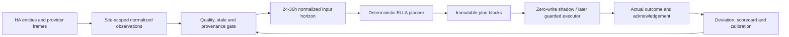

# ELLA - Energi, Last, Lagring & Automation

Status: planning contract, no control path authorized

Date: 2026-09-19

This document is the planning baseline for a future battery planning and
control system inside Elräkning. ELLA is deliberately a separate decision
layer. It does not authorize battery writes, change the current integration,
or replace the existing Solar Evidence, Single Run, tariff, provider, or
canonical contracts.

## 0. Current baseline and reconciliation

The current repository/runtime baseline used for this plan is Elräkning
`0.0.651` with the docs reconciliation commit `2776ea9`. The verified current
runtime facts used here are:

- Vikarbodarna remains the active development site and continues site-independent
  background collection.
- Fiskvik remains a clean room for unconfigured provider/weather/solar/battery
  inputs. No ELLA data or decisions may be fabricated for it.
- Vikarbodarna has verified Greenely proof and two natural
  `greenely.invoice_economics.v1` canonical frames. Greenely is usable as
  bounded economic context, not as a replacement for physical meter data.
- Vikarbodarna has a verified natural
  `open_meteo.single_run_day_ahead_pv.v1` frame. Forecast.Solar, Open-Meteo,
  weather, Solar Evidence, and canonical integrity gates remain separate.
- The `0.0.651` invoice estimator is a full-month estimate. It uses current
  Recorder meter observations, a trailing 28-complete-day baseline, a blend
  weight that grows with covered days, known future price periods, and explicit
  confidence/fallback metadata. This is useful input for ELLA, but it is not
  yet a first-class hourly load-forecast dataset.
- No live ELLA planner, executor, battery command, service, or control loop
  exists. This plan therefore starts with observation and simulation.

The 2026-09-04 Elräkning Masterplan remains valid where it specifies capture
first, immutable provenance, site independence, canonical 15-minute data,
deterministic MPC/LP/MILP, shadow mode without write capability, replay before
optimization, safety limits above ML, and long-term battery-health accounting.
The older plan's statements derived from the 0.0.594 audit are historical,
not current runtime claims. ELLA treats them as requirements to re-verify, not
as evidence that a current dataset already exists.

## 1. Data map: available, reusable, and missing

The following table distinguishes a reusable source from a source that is
already suitable as an ELLA decision contract.

| Data | Current source/path | Resolution and retention | Provenance/current quality | ELLA use now | Missing for control |
|---|---|---|---|---|---|
| PV actual | Site `power.solar_entities`, `PowerManager`, power history and canonical power roles | HA state cadence; history depends on Recorder/canonical coverage | Site-scoped source mapping, unit validation, signed power normalization | Actual PV and self-consumption observation | Long-term guaranteed canonical 15-minute PV contract and per-array capability identity |
| Forecast.Solar | HA Forecast.Solar entities through site binding; `forecast_solar.observed_facts.v1` | Provider/entity cadence; immutable canonical revisions | Provider-native HA-state capture time, site generation and target semantics | Candidate forecast and bias input | A stable decision-ready interval/scenario contract and longer verified seasonal retention |
| Open-Meteo manager forecast | `open_meteo.manager_forecast.v1` | Hourly future forecast, manager horizon | Site location/geometry, source generation, known_at and target interval | Weather/irradiance forecast feature | Decision-time scenario/uncertainty packaging and stable long-horizon retention |
| Open-Meteo Single Run | `open_meteo.single_run_day_ahead_pv.v1` | Single day-ahead target interval | Response receipt, run initialization, target interval, causal status | High-value day-ahead PV input | More natural frames and a consumer contract for planner selection |
| Solar Evidence | Solar Evidence v1 stores and completed audit rows | Daily completed-day evidence | Historical baseline/progress, quality and common-source comparison | Bias/confidence calibration only | A formal ELLA confidence adapter; never rewrite Evidence |
| Total consumption/load | Site power `consumption_entity`, meter `power_entity`, HA Recorder, `energy_history`, canonical house/grid roles | Live state plus Recorder history; current billing reader requests current month + trailing 28 days | Unit/sign validation; runtime gross-load semantics are useful, but template dependency provenance is limited | Current load and short baseline | First-class immutable load series, explicit gross/net semantics, robust stale policy |
| Billing estimator load forecast | Frontend `buildInvoiceEstimate`, billing websocket, 28-day complete-day baseline | Current month plus bounded trailing baseline | Deterministic, test-covered, confidence/fallback metadata | Reuse its normalized source/model, not its invoice UI output | Extract shared engine and publish hourly/15-minute forecast frames |
| Spot price | Nord Pool coordinator and `get_price_indices_for_date`, 15-minute normalized periods | Daily fetched periods; coordinator cache is bounded | Area/currency, normalized units, fetch/capture context; canonical persistence path exists | Price periods and known future horizon | Fully explicit publication-state contract and durable replay selection for every decision |
| Retail/electricity price | Customer-price builder plus verified provider tariff | Applied per price period | Provider eligibility, VAT and ex-VAT semantics | Variable import cost | Explicit effective-period revisions and planner-side source contract |
| Grid cost, tax, VAT, fixed fees | E.ON grid binding and `site_economic_frames`; customer-price/grid serialization | Current snapshot/effective contract data | Gross/VAT/source status validation; missing components remain unavailable | True marginal import cost and fixed monthly context | Time-valid tariff frame, export compensation contract, demand/peak tariff contract |
| Greenely invoices/economics | Greenely Store plus `greenely.invoice_economics.v1` | 52 persisted Vikarbodarna invoices and 1,153 normalized samples were verified; two canonical economics frames | Proof is `EXPLICITLY_VERIFIED`; privacy migration passed; Fiskvik is zero | Invoice/economic calibration and historical context | Correction/reissue occurrence semantics remain open; not a physical meter substitute |
| Battery SOC | Site `power.soc_entity`, `PowerManager`, `%` validation and history | HA cadence/history when mapped | Range/unit validation and `max_hold_seconds=900` role contract | Live SOC and replay feature | Per-ESS identity, stale/unknown policy, BMS acknowledgement and source generation |
| Battery charge/discharge power | Combined signed `battery_power_entity` or separate charge/discharge entities | HA cadence/history when mapped | Sign convention is explicit: positive discharge, negative charge; unit normalization exists | Actual battery flow and cycle accounting | Per-ESS split, command limits, ramp/min-duration and acknowledgement |
| Battery capacity | `power.capacity_entity`, normalized to kWh | Live state/history when mapped | Unit validation exists | Usable-capacity input if the entity is truthful | Distinguish nominal/usable/available capacity and calibration confidence |
| Battery efficiency | No verified first-class runtime dataset | Not established | Not established | None beyond configured assumption in a future model | Charge, discharge and standby-loss estimates calibrated from energy balance |
| Inverter limits | Generic power mappings exist; explicit limits are not a complete ELLA capability model | Not established per ESS | Not established as immutable capability frames | None safely for control | Max charge/discharge, ramp, minimum command duration, reserve and derating |
| Export/grid constraints | Grid import/export roles and phase/fuse diagnostics exist | Live/history depending on mapped entities | Sign normalization and phase diagnostics exist | Observation and peak analysis | Explicit export-limit/import-limit policy and enforcement capability |
| Temperature/weather | SMHI current/hourly canonical weather plus Open-Meteo weather/irradiance paths | Current and hourly provider cadence | Site timezone, fetched/known/validity metadata; Fiskvik no fabricated weather | Load/PV feature and derating input when valid | Temperature-to-load model, battery-temperature source and stale/derating policy |
| Site isolation | `site_identity`, collection-enabled target enumeration, site-scoped bindings/generations | Persistent site configuration | Runtime-verified site-independent collection and Fiskvik clean room | Required boundary for every ELLA input/plan | ELLA-specific resource registry and cross-site aggregate policy |
| Provenance/quality | Canonical frame fields, source generations, known/captured/fetched times, quality/status | Dataset dependent | Strong for current canonical external inputs; gaps remain for long-term load/battery | Plan eligibility, replay cutoff and fail-closed logic | One normalized ELLA input-frame envelope and source-specific stale thresholds |

### 1.1 Battery systems and the two Growatt question

The current code models battery input generically per site, not as a verified
multi-ESS resource graph. It supports one combined signed battery-power entity
or separate charge/discharge entities, one SOC entity and one capacity entity.
The current repository/runtime evidence does not prove two independently
modeled Growatt systems with separate identities, limits, SOC, usable capacity,
or inverter acknowledgements.

ELLA must therefore represent each physical ESS separately internally once the
entities are verified. An aggregate UI is allowed only after the per-ESS
ledger is complete. A missing second-system identity is not permission to sum
two sensors by name or numerical coincidence.

### 1.2 Direct reuse versus required extraction

The `0.0.651` billing estimator already has the correct conceptual pieces for
a consumption forecast, but its API is currently coupled to the billing UI
and a bounded Recorder query. ELLA must extract the normalized time-series
and forecast policy into a first-class, versioned dataset. The invoice card
and ELLA must then consume the same forecast frame; they must never maintain
two diverging load models.

## 2. ELLA architecture and invariants



Every planner input must carry site scope, source identity/generation,
observed/known/captured times where applicable, unit, sign convention,
quality, stale state, and model/contract version. A plan is not executable
unless all required inputs pass their source-specific eligibility gate.

Active UI site is never a planner input. A background planner enumerates
collection-enabled sites and binds every plan to exactly one site and one
resource registry snapshot.

The planner works at a canonical 15-minute step in V1, with a 24-36 hour
horizon. A 30-minute presentation or execution block may contain two canonical
steps, but must retain the underlying step references. Replanning occurs at
new price publication, new solar/load forecast, material state deviation, and
the normal bounded cadence; only the first executable step is ever sent to a
future executor.

Decision types are explicit and mutually auditable:

- `charge_from_solar`
- `charge_from_grid`
- `discharge_to_load`
- `hold_soc`
- `create_solar_headroom`
- `reserve_energy`
- `no_action`
- `failsafe`

`create_solar_headroom` means a bounded pre-emptive discharge decision made to
preserve expected PV capture. It may not violate reserve SOC, export policy,
or inverter limits. `failsafe` is not an optimizer preference; it is the
result of an invalid/stale input or hardware safety condition.

## 3. Phase roadmap

### Phase 0 - data contracts, observation and invariants

Objective: make every input safe to reason about before forecasting or
planning.

Inputs: existing site bindings, PowerManager/MeterManager roles, canonical
frames, Recorder observations, Nord Pool periods, weather, provider tariffs,
SOC and battery configuration.

Outputs: versioned ELLA observation envelope; source-generation and site
registry snapshot; explicit unit/sign/stale/quality fields; a per-ESS
capability record.

Contracts: no active-site dependency; no raw provider credentials or PII;
`known_at` and `observed_at` remain distinct; missing, stale, unavailable or
ambiguous source identity is represented explicitly, never filled silently.

Tests: unit normalization, sign conventions, source replacement, site
isolation, DST, unavailable/unknown/stale values, meter reset/rollover and
duplicate observation behavior.

Runtime gate: read-only observation only; Vikarbodarna must remain valid and
Fiskvik must remain zero when its source is not eligible.

Fail-closed: no plan if load, SOC, site scope or safety capability is invalid.

UI/non-goal: no ELLA UI and no commands.

### Phase 1 - first-class Load Forecast dataset

Objective: extract the proven `0.0.651` consumption estimator into a shared
forecast producer used by billing and ELLA.

Inputs: Recorder/canonical load observations, historical complete-day baseline,
time-of-day/day-of-week/season features when available, temperature, calendar,
site calibration, and current quality.

Outputs: hourly or 15-minute load forecast over 24-36 hours with central,
low and high scenarios; `known_at`; model version; baseline source; coverage;
confidence; fallback reason; target intervals and site scope.

Contracts: the invoice estimator and ELLA reference the same immutable forecast
frame. A monthly estimate may aggregate it, but must not create a second model.
Missing history uses an explicit low-confidence global/current fallback and
never pretends to be measured.

Tests/gates: day-one, missing history, DST 23/24/25 hours, gaps, unavailable
source, temperature scenarios, replay cutoff, site isolation and consistency
between billing and ELLA consumers.

Fail-closed: no automatic battery plan from a low-confidence load forecast
unless a conservative policy explicitly permits `hold_soc` only.

UI/non-goal: retain the current invoice card; no planner controls.

### Phase 2 - corrected Solar Forecast and bias model

Objective: provide a decision-ready PV forecast while preserving each provider
source and Evidence history.

Inputs: Forecast.Solar observations, Open-Meteo manager/Single Run, SMHI/weather,
PV geometry, actual PV, Solar Evidence accuracy/bias and site calibration.

Outputs: provider-specific immutable input frames, blended central/low/high PV
scenarios, bias/confidence metadata, and a decision cutoff selection.

Contracts: no Evidence rewrite, no previous-day1 substitution into another
dataset, no fabricated Fiskvik data, and no cross-generation supersedes.

Tests/gates: known-at replay, pre/post-decision status, weather/provider gaps,
solar horizon, DST, natural Single Run selection and site isolation.

Fail-closed: conservative PV scenario or `hold_soc`; never charge from an
unverified forecast as though it were measured.

UI/non-goal: continue existing solar cards; show ELLA confidence only in later
advisory UI.

### Phase 3 - Battery/ESS physical model per system

Objective: build a measurable digital twin for each ESS, not one opaque
aggregate.

Inputs: per-ESS SOC, nominal/usable/available capacity, charge/discharge power,
efficiency, standby loss, reserve/min/max SOC, inverter limits, temperature,
derating, command interval and acknowledgement.

Outputs: predicted SOC trajectory, energy balance, charge/discharge feasibility,
throughput/EFC, degradation-cost estimate and capability fingerprint.

Contracts: per-ESS resource ID, signed power convention, hard bounds, energy
conservation tolerance and explicit unknown state. Aggregate site values are
derived from per-ESS records.

Tests/gates: round-trip efficiency, SOC limits, clipping, simultaneous systems,
missing telemetry, command duration, ramp limits, DST-neutral energy balance,
and measured-vs-predicted SOC drift.

Fail-closed: no discharge/charge plan when SOC, capacity, efficiency or hard
limit is unknown; use `failsafe`/`hold_soc` only.

UI/non-goal: no hardware command path.

### Phase 4 - price and true marginal cost model

Objective: normalize the actual economic objective without double counting.

Inputs: Nord Pool 15-minute periods, publication/known-at state, Greenely
retailer economics, E.ON transfer/tax/VAT/fixed fees, export compensation,
degradation cost and peak policy.

Outputs: import marginal cost, export value, fixed-cost context, degradation
penalty and price confidence for each horizon step.

Contracts: VAT/unit basis is explicit; known future periods are selected by
decision time; unknown horizon uses a documented fallback; negative prices and
export are valid; invoice occurrence/correction ambiguity cannot silently
change a historical tariff frame.

Tests/gates: publication cutoff replay, tariff revisions, missing components,
negative prices, fixed-fee non-duplication, export limit, DST and Greenely
fail-closed behavior.

Fail-closed: if true marginal cost or export value is unknown, allow only
non-economic self-consumption shadow scenarios, not live economic execution.

UI/non-goal: no new tariff editor in this phase.

### Phase 5 - ELLA planner in shadow mode

Objective: produce immutable plans with a technically impossible write path.

Inputs: normalized forecast frames, live state, ESS capabilities, prices,
site policy and safety limits.

Outputs: plan blocks with `decision_at`, horizon, action, target power/SOC,
reason, objective breakdown, input-frame references, model/calibration hashes,
predicted cost, throughput and reserve margin.

Contracts: shadow adapter has no command method. Attempting a write is a
contract error. Plans are site-scoped, reproducible and immutable.

Tests/gates: zero-write enforcement, deterministic solver output, no cross-site
inputs, plan stability/hysteresis, reserve violations zero, stale input
rejection and replay determinism.

Fail-closed: emit an immutable `failsafe`/`no_action` plan with reason, never a
partially specified command.

UI/non-goal: no action buttons.

### Phase 6 - backtest and scorecards

Objective: prove value and safety against history before advice or control.

Inputs: at least 30-60 days where real data exists; target is a full season
when retention allows it. Replay uses only frames with `known_at <= decision_at`.

Outputs: scorecards for no-battery, self-consumption, cheapest-hours,
threshold, ELLA and perfect-hindsight oracle; savings, import/export, peak,
throughput/EFC, missed solar, degradation-adjusted savings, regret and safety.

Contracts: run ID, dataset/model/calibration/parameter versions, deterministic
seed where relevant, source fingerprints, scenario and result quality.

Tests/gates: DST, source change, gaps, stale signals, forecast publication,
counterfactual gross-load correctness and zero safety violations.

Fail-closed: an incomplete or hindsight-contaminated run is non-qualifying,
not silently scored as success.

UI/non-goal: internal scorecards first; no live recommendations yet.

### Phase 7 - advisory UI only

Objective: show understandable plans without allowing control.

Inputs: qualifying shadow plans and scorecards.

Outputs: compact plan cards, expanded timeline, why/confidence/source details,
planned-vs-actual after observation.

Contracts: UI cannot mutate plan or device state; stale plans visibly expire;
site name and action scope are explicit.

Tests/gates: rendering, accessibility, mobile width, empty/fail-safe states,
Fiskvik no-fabrication and plan-to-frame provenance links.

Fail-closed: hide actionable advice when a required input is stale or identity
is ambiguous.

UI/non-goal: no enable/execute control.

### Phase 8 - guarded execution

Objective: add a narrow hardware adapter only after shadow/backtest acceptance.

Inputs: an approved plan, live revalidation, per-ESS capability, acknowledgement
channel and user policy.

Outputs: at most the first plan step as a command, acknowledgement, timeout,
actual result and deviation event.

Contracts: explicit arming, manual override, command idempotency, rate limit,
minimum duration/change, reserve enforcement, wrong-site prevention and
rollback/safe fallback.

Tests/gates: hardware-in-the-loop or supervised adapter tests, command timeout,
unavailable inverter, stale SOC, changed site binding and duplicate command.

Fail-closed: no acknowledgement or any boundary violation means no further
commands and deterministic safe fallback.

UI/non-goal: no autonomous learning of safety limits.

### Phase 9 - closed-loop learning and drift detection

Objective: improve forecasts and calibration without changing safety bounds.

Inputs: planned-vs-actual outcomes, forecast errors, SOC residuals, efficiency,
temperature, throughput and site changes.

Outputs: calibration events, drift alerts, model candidates and versioned
promotion decisions.

Contracts: old plans remain reproducible; global model and site calibration are
separate; no automatic safety-limit widening; promotion requires scorecard
evidence and rollback.

Tests/gates: drift thresholds, leave-one-site-out evaluation, seasonal split,
no leakage, model rollback and safety invariants unchanged.

Fail-closed: freeze learning promotion and keep the last safe model/calibration
when data quality or drift is ambiguous.

UI/non-goal: no opaque self-modifying controller.

## 4. Planner decision model

At each 15-minute step the planner solves a constrained horizon problem. The
first version should use deterministic LP/MPC logic; forecast models provide
scenarios and confidence but never override physical limits.

For each ESS `e` and step `t`, the model must represent:

- SOC, usable energy, charge/discharge power and efficiency;
- min, max and reserve SOC;
- standby loss and degradation cost;
- inverter ramp/minimum duration/derating constraints;
- site load, PV, grid import/export and shared export limit;
- price, tariff, tax, VAT, fixed-cost context and export value;
- uncertainty reserve and stale-input state.

The physical balance is explicit. In a simplified form:

```text
SOC[t+1] = SOC[t]
  + charge_power[t] * charge_efficiency[t] * step_hours
  - discharge_power[t] / discharge_efficiency[t] * step_hours
  - standby_loss[t]
```

Grid flow must be calculated from gross load and PV, not inferred from a
battery-affected net meter when the planner is evaluating a counterfactual:

```text
virtual_grid = gross_load - pv + total_charge - total_discharge
```

The planner must preserve a shared site grid constraint while solving separate
ESS states. If an ESS capability is missing, it is excluded from executable
planning and may appear only in an explicitly marked incomplete shadow run.

## 5. UI integration in the existing dashboard

The existing panel already uses compact live-power tiles for Sol, Förbrukning,
Nät, Batteri and `Estimerad faktura`, followed by price, energy, history,
provider, Evidence and diagnostic cards. Its visual language uses the HA card
background, existing divider/text variables, compact headings, rounded cards,
and restrained accents:

- solar: muted green;
- consumption: coral/red;
- import: orange;
- export: blue;
- charging/discharging: purple/pink;
- primary dashboard accent: HA primary color.

ELLA should reuse these tokens and spacing rather than introduce a separate
hero visual system.

### Option A - compact decision rail (recommended)

Add a small `ELLA · Energiplan` section after the live-power row and before the
price chart. The collapsed section contains a horizontal rail with 3-5 cards;
additional blocks scroll horizontally. Each card contains:

```text
17:00-19:30 · Urladda batteri
Mål-SOC 72 -> 38 %
Varför: dyraste importperioden
Planerad besparing 5,80 kr
Planerad
```

After observation it becomes:

```text
Utförd · plan 5,80 kr / utfall 5,10 kr
Avvikelse: +0,70 kr
```

The section has one `Visa plan` expansion control. The default height is close
to an existing compact card; the expanded state shows a Huawei-inspired but
Elräkning-styled timeline using the existing chart colors.

### Option B - one compact summary card

One card shows the next action, current SOC, plan confidence, and a small
progress strip. Expansion opens all blocks. This has the lowest vertical cost
but hides the multi-step plan and is less useful for debugging.

### Option C - full timeline card

A full-width card immediately before the price chart shows the entire 24-36
hour plan and a graph by default. It is closest to Scheduling Analysis but
uses more space and makes ELLA visually dominate the existing dashboard.

Recommendation: Option A. It preserves the dashboard's current density,
supports quick scanning, and still gives a detailed timeline on demand.

Card anatomy and states:

1. local time range and action;
2. target SOC/power and affected ESS label;
3. one-line reason;
4. planned cost/saving or `not available`;
5. status: `Planerad`, `Pågår`, `Utförd`, `Avvikelse`, `Ej tillgänglig`;
6. small confidence/source marker;
7. expanded details: input frame timestamps, forecast confidence, planned vs
   actual and deviation reason.

No UI card may imply that a plan was executed when it was only shadow/advisory.
No card may appear for Fiskvik without an eligible physical/source contract.

### 5.1 Shared price/energy forecast graph

The existing price graph becomes the shared price and energy-plan graph. It
must be able to overlay the following independent, individually toggleable
layers:

1. `purchase_price`;
2. `sell_price` / feed-in price when available;
3. `actual_import_kw` and `forecast_import_kw`;
4. `actual_export_kw` and `forecast_export_kw`;
5. `actual_pv_kw` and `forecast_pv_kw`;
6. `actual_load_kw` and `forecast_load_kw`;
7. `actual_battery_charge_kw` and `planned_battery_charge_kw`;
8. `actual_battery_discharge_kw` and `planned_battery_discharge_kw`.

The visual contract is strict:

- solid line means actual/observed;
- dashed line means estimated/forecast/planned;
- the estimated segment starts at the latest actual point and continues
  forward without a visual gap when the source coverage permits it;
- actual and estimated variants of one signal use the same signal color;
  dash pattern and restrained opacity, not a second color palette, provide the
  primary distinction;
- each signal has its own legend/toggle;
- the default layer set is `purchase_price`, actual/forecast import, actual/
  forecast PV, and actual/forecast load. Sell price, export, battery
  charge/discharge and detailed plan consequence layers are opt-in so the
  default view remains readable;
- existing card spacing, typography, borders, background and palette are
  reused.

`forecast_load` and `forecast_pv` are exogenous forecast inputs. Once ELLA
has planned a response, import, export, charge and discharge consequences are
not independent forecasts: they are calculated consequences of the plan and
must be named `planned_import_kw`, `planned_export_kw`,
`planned_battery_charge_kw` and `planned_battery_discharge_kw` in the data
contract. The UI may present both classes as “Estimerad” where useful, but
the serialized names and provenance must remain distinct. A future compatibility
alias may expose `forecast_*` to older consumers only if it carries the
explicit planned/exogenous classification.

### 5.2 Battery graph and multi-ESS detail

The SOC graph overlays `actual_soc` as a solid series and
`planned_soc`/`estimated_soc` as a dashed forward series. Planned SOC must be
derived from the same ELLA plan and the same per-ESS digital-twin transition
model that produced the charge/discharge plan. The frontend must never
recalculate a separate SOC trajectory.

If multiple ESS resources are summarized in the compact UI, the aggregate SOC
is capacity-weighted over valid usable capacities:

```text
aggregate_soc = sum(usable_capacity_e * soc_e) / sum(usable_capacity_e)
```

An ESS with unknown/stale usable capacity is excluded from the aggregate and
causes the aggregate to be marked incomplete; it is not silently treated as
zero. The detail view must retain per-ESS SOC, power, limits, efficiency,
quality and provenance even when the compact graph shows an aggregate.

### 5.3 Plan-card and graph synchronization

The horizontal ELLA plan cards and the shared graph use the same plan-block
intervals. Clicking or hovering a card highlights its interval and the
corresponding planned charge/discharge, import/export and SOC layers. The
card status `Planerad`, `Pågår`, `Utförd` or `Avvikelse` controls the comparison
shown in the same interval:

- planned dashed series remain the immutable plan;
- actual solid series show observed outcome;
- `Utförd` exposes planned versus actual values;
- `Avvikelse` exposes the bounded deviation and reason, without rewriting the
  plan.

Option A therefore has the compact card rail above the graph in its collapsed
form. `Visa plan` expands the shared multi-layer graph below the rail. Option B
may use the same graph behind one summary card, while Option C may show the
graph by default, but none may introduce a separate ELLA palette or a second
time axis.

### 5.4 Shared plan-block selection across graphs

ELLA cards are directly linked to both the shared price/energy graph and the
battery/SOC graph through one presentation-level selection state. A plan card
must carry a stable `plan_block_id`, `planned_start`, `planned_end`, action type
and plan revision. Selection must never be resolved from display text.

Clicking a card for, for example, `13:00-17:00` selects exactly that interval
in every relevant graph. The selection is rendered as a low-opacity vertical
time band with a restrained outline over the plotting area. It must not alter
any series values. The selected card receives a matching selected state, and
clicking another card moves the selection to that card's interval. Clicking
the selected card or an empty graph area may clear it. Hover may provide a
temporary preview highlight; click/pin remains persistent until selection is
changed or cleared.

The shared state applies at minimum to:

1. the price/energy graph with purchase/sell price, import/export, PV, load,
   battery charge and battery discharge actual plus estimated/planned layers;
2. the battery/SOC graph with actual SOC plus planned/estimated SOC.

Future timeline graphs must consume the same shared selected-plan-interval
state rather than creating independent selections. The state is presentation
state only and never mutates canonical frames, plans or runtime data. It must
be shared by the compact rail and the expanded `Visa plan` view.

Selection semantics depend on plan status:

- `Planerad` and `Pågår` highlight where the action is planned or currently
  occurring;
- `Utförd` and `Avvikelse` keep the card's primary interval as the default
  selected band and compare planned dashed series with actual solid series;
- when actual execution start/end differs from the planned interval, the detail
  view exposes both intervals. The primary band remains one uncluttered
  interval, while tooltip/detail explains the deviation. A suitable label is
  `ELLA 13:00-17:00 · Urladda batteri`.

The band uses the existing palette and a theme-safe low opacity/outline so it
is visible in dark and light themes without dominating the graph. It must be
clipped to the plotting area and never extend outside the selected interval.

Selection acceptance tests must prove:

- selecting 13:00-17:00 highlights exactly the same interval in both graphs;
- the selection survives a normal rerender/data refresh while the same plan
  revision exists;
- a stale or replaced plan revision clears or safely remaps the selection;
- no highlight is rendered outside the selected interval;
- keyboard focus, activation, clear and selected states are accessible;
- horizontal mobile card scrolling preserves the selected card association.

### 5.5 Forecast rendering rules

The graph must not draw a forecast/planned line when its source is stale,
unavailable or ambiguous. A missing segment remains missing; interpolation may
not make an unverified forecast appear continuous. Low confidence is shown
discreetly in the legend and tooltip with source/confidence metadata, not as a
large warning block that obscures the graph. A plan consequence is also hidden
when its referenced plan, ESS capability or input frame is invalid.

## 6. Data -> decision -> outcome contract

```text
Forecast inputs
  -> normalized time series and quality gate
  -> site/ESS capability snapshot
  -> ELLA planner
  -> immutable plan blocks
  -> zero-write shadow, later guarded executor
  -> actual telemetry and acknowledgement
  -> planned-vs-actual deviation
  -> scorecards and calibration/drift
```

The invoice forecast and ELLA share the same load-forecast frame. Solar
Evidence's accuracy/bias is a confidence/scenario input, not a replacement for
the immutable source forecast. Greenely invoice economics informs tariff and
economic context only; its proof and occurrence semantics remain separate from
physical load/PV/battery attribution.

## 6.1 First-class graph datasets and frame requirements

The graph is only correct when each layer is backed by a first-class,
site-scoped frame or telemetry series. The minimum set is:

| Dataset/frame | Role | Required metadata |
|---|---|---|
| Load forecast | Exogenous load trajectory | `site_id`, target interval, `known_at`, model/source version, quality, confidence and forecast scenario |
| Solar forecast raw | Provider-specific PV trajectory | `site_id`, target interval, `known_at`, provider/source generation, model version, quality and confidence |
| Solar forecast corrected | Bias-adjusted PV trajectory | `site_id`, target interval, `known_at`, correction/calibration version, source-frame references, quality and confidence |
| Purchase/sell price frame | Import cost and export value | target interval, `known_at`, publication state, tariff/VAT/unit semantics, source/version, quality and confidence |
| ELLA plan frame | Planner decisions and consequences | `site_id`, `planned_at`, decision horizon, plan version, parameter hash, input-frame references, action blocks, quality and confidence |
| Planned SOC trajectory | Result of the per-ESS digital twin | `site_id`, `planned_at`, target interval, plan version, ESS resource identity, model version, quality and confidence |
| Planned grid trajectory | Plan-derived import/export consequence | `site_id`, `planned_at`, target interval, plan version, source plan reference, constraint state and confidence |
| Actual telemetry | Observed load, PV, grid, battery power and SOC | `site_id`, observed interval, `known_at` when delayed, source identity/generation, unit/sign convention, quality and stale state |

`planned_at` identifies when ELLA produced the plan; it does not replace
`known_at` for source forecasts or `observed_at` for actual telemetry. Every
frame must also carry its schema/contract version and remain replay-selectable
by the decision cutoff. The graph is a consumer of these frames, not a place
where missing provenance or SOC transitions are reconstructed.

## 7. Safety, site isolation and fail-closed rules

- No planner may read `active_site_id` to choose a background target.
- Every input, plan and outcome is bound to one site and one source generation.
- Fiskvik remains zero when location, source binding, physical geometry,
  invoice proof, or battery capability is absent.
- Missing/stale SOC, meter, PV, load, price or inverter acknowledgement blocks
  execution. The safe fallback is simple hold/no-action, not a forecast guess.
- Export limit zero is a real constraint, not an instruction to discard PV.
- Grid-import limits and phase/fuse protection are hard constraints separate
  from economic optimization.
- Shadow mode has no service/action write path by construction.
- Manual override always wins and is recorded as an event.
- Raw PII, credentials, signed URLs, provider OCR, meter/install identifiers
  and opaque secrets never enter ELLA plans, UI diagnostics or canonical
  provenance.

## 8. Backtest and acceptance gates

Before advisory mode:

1. collect or verify at least 30-60 days of eligible per-site observations;
2. replay only information known at each historical decision time;
3. compare no-battery, self-consumption, threshold, cheapest-hours, ELLA and
   perfect-hindsight baselines;
4. report cost/savings, import/export, peak, missed PV, throughput/EFC,
   degradation-adjusted value, command count, regret and forecast error;
5. require zero reserve/limit/site-identity violations;
6. verify DST and provider/source-generation changes;
7. repeat the same run deterministically from the same immutable inputs.

An advisory release requires a qualifying shadow scorecard. A guarded executor
requires supervised runtime evidence, one-step command acknowledgement, safe
fallback and rollback evidence. A natural provider frame may be observed, but
manual forecast/Evidence/Single Run fabrication is never an acceptance method.

## 9. Recommended first implementation release

The first ELLA implementation should not be a battery-control release. The
recommended first scope is a data-contract and shared-load-forecast release:

1. extract the `0.0.651` estimator into a provider-neutral first-class load
   forecast producer;
2. publish hourly/15-minute forecast frames with scenarios, confidence,
   known_at and source references;
3. make the invoice card consume that same frame;
4. add a read-only per-ESS capability audit, without assuming two Growatt
   systems exist;
5. add no planner, service, write path or ELLA card yet.

Only after this is runtime-stable should the next release add the V1 ESS
digital twin and zero-write shadow planner.

## 10. Open gates before any live control

- Explicit gross-house-load and grid import/export semantics per site.
- First-class long-term load/PV/grid/battery/SOC canonical retention.
- Per-ESS resource discovery and separate identity for each inverter/battery.
- Usable versus nominal capacity and calibrated charge/discharge/standby loss.
- Min/max/reserve SOC and inverter command capabilities.
- Export and grid-import policy, including phase/fuse protection.
- Persistent price publication/known-at frames and valid export compensation.
- Load forecast dataset shared with billing and ELLA.
- Solar bias/confidence adapter sourced from Evidence without rewriting Evidence.
- 30-60 day replay/backtest with zero safety violations.
- Shadow adapter with no physical write method.
- User-visible advisory semantics that distinguish planned, executed and
  deviated actions.
- Authenticated runtime evidence for every site before it can become an ELLA
  execution target.

## 11. Capture-first data-gap audit

This audit is a planning classification, not proof that an unverified live
entity exists. `ALREADY_CAPTURED_LONG_TERM` means that the current canonical
or immutable store has sufficient site-scoped provenance and retention for
replay. Recorder-only or bounded UI history is deliberately not counted as
long-term capture. `AVAILABLE_BUT_NOT_SAFELY_CAPTURED` means that the role is
mapped, readable, or used by existing code, but its detail, provenance,
retention, or per-resource identity is insufficient. `NOT_AVAILABLE_OR_NOT_VERIFIED`
means that the role must be discovered or configured before ELLA may use it.

### 11.1 Current classification

| Signal family | Classification and current path | Native cadence / retention known today | ELLA capture target and provenance | Why late capture is costly |
|---|---|---|---|---|
| Gross house load / total consumption | `AVAILABLE_BUT_NOT_SAFELY_CAPTURED`; site consumption/meter roles, Recorder and the billing reader | HA/Recorder cadence is source-dependent; long-term retention is not guaranteed by the current role | 1-5 min detail plus canonical 15 min; `site_id`, source generation, observed/known time, unit, sign and quality | Missing gross load cannot be reconstructed from an invoice total without losing peaks and causality |
| Grid import/export power and cumulative energy | `AVAILABLE_BUT_NOT_SAFELY_CAPTURED`; mapped grid power/energy roles and history paths | Runtime mapping exists; durable per-interval coverage is not established | Signed 1-60 s raw where available, 1-5 min detail, 15 min canonical; meter reset/rollover and source generation required | Peak, export-limit and self-consumption decisions need interval data, not later totals |
| PV total and per-inverter/string | Total PV role is `AVAILABLE_BUT_NOT_SAFELY_CAPTURED`; per-inverter/string is `NOT_AVAILABLE_OR_NOT_VERIFIED` | HA/provider cadence is mapped per site; long-term per-array retention is not proven | Per source 1-60 s raw if available, 1-5 min detail, 15 min canonical; source identity, unit, sign and generation | Provider forecasts cannot recover clipping, inverter imbalance or missed solar |
| Battery charge/discharge/signed power and counters | Combined signed power is `AVAILABLE_BUT_NOT_SAFELY_CAPTURED`; separate counters/per-ESS paths are `NOT_AVAILABLE_OR_NOT_VERIFIED` | Generic `battery_power_entity`/charge/discharge roles exist; per-ESS retention is not proven | Per ESS 1-60 s raw if supported, 1-5 min detail, 15 min canonical, event counters; explicit sign and reset semantics | Without charge/discharge history, efficiency, cycles and command outcomes are unknowable |
| ESS SOC, capacity and health | SOC/capacity roles are `AVAILABLE_BUT_NOT_SAFELY_CAPTURED`; SOH, temperature, cell and dynamic limits are `NOT_AVAILABLE_OR_NOT_VERIFIED` | Mapped roles have HA history; long-term per-ESS identity and BMS provenance are not proven | SOC/power/capability snapshots at 1-60 s raw or source cadence, 1-5 min detail, 15 min canonical; capability generation, stale state and quality | A later digital twin cannot infer reserve breaches, derating or degradation history |
| Grid phases and safety | Phase/grid diagnostics are `AVAILABLE_BUT_NOT_SAFELY_CAPTURED`; fuse/export-limit semantics are `NOT_AVAILABLE_OR_NOT_VERIFIED` | Diagnostics are available where mapped; retention is not guaranteed | Phase current/voltage/power at source cadence, event capture for outage/health, canonical 15 min summaries; safety source generation | Safety envelopes and phase violations cannot be replayed from aggregate kWh |
| Purchase/sell price and tariffs | Nord Pool/provider price and site economic frames are `AVAILABLE_BUT_NOT_SAFELY_CAPTURED` for full ELLA replay; some immutable external frames already exist | Price periods are normally 15 min/day-ahead; tariff validity/retention differs by source | Immutable 15 min price/tariff frames with `known_at`, publication state, effective interval, VAT/unit and source version; daily/event summaries long-lived | A later tariff revision must not rewrite what the planner knew at decision time |
| Greenely invoice/economics | `ALREADY_CAPTURED_LONG_TERM` for verified Vikarbodarna invoice/economic records; not physical telemetry | 52 invoices and 1,153 normalized samples were verified; canonical economics frames are sparse | Retain immutable occurrence/revision, contract attribution, economics and provenance; no raw PII; Fiskvik remains zero | Historical invoice context is useful calibration, but cannot replace missing interval meter data |
| Forecast.Solar raw / corrected | Raw immutable forecast/provenance is `ALREADY_CAPTURED_LONG_TERM` for current verified Vikarbodarna paths; corrected model is `AVAILABLE_BUT_NOT_SAFELY_CAPTURED` | Natural canonical frames and evidence exist; corrected forecast contract is not yet first-class | Preserve raw frames; add separate corrected frames with source frame IDs, `known_at`, calibration version, confidence and target interval | Raw provider history cannot be recreated after a forecast revision |
| Open-Meteo, Single Run and weather | Open-Meteo/Single Run frames and weather are `ALREADY_CAPTURED_LONG_TERM` only for the verified frames/roles; broader cadence is `AVAILABLE_BUT_NOT_SAFELY_CAPTURED` | Verified natural Single Run exists; broader seasonal retention is not established | Immutable target-day frames, weather observations and forecasts with response/known times, target timezone, model/source generation and confidence | Missing weather vintages prevent causal forecast-error analysis |
| Load forecast | Existing billing estimator is `AVAILABLE_BUT_NOT_SAFELY_CAPTURED`; its output is not yet a first-class immutable dataset | Current month/trailing 28-day model; no long-term forecast-frame retention | Hourly/15 min frames, 24-36 h horizon, model/calibration version, `known_at`, scenarios and confidence | Future ELLA and billing cannot reproduce past decisions without forecast vintages |
| Temperature and load features | Weather/temperature sources are `AVAILABLE_BUT_NOT_SAFELY_CAPTURED`; calendar effects are derivable but not persisted as an ELLA feature contract | Provider cadence varies; retention is dataset-dependent | Persist technical weather/calendar features used by a model with source/known time; never infer occupancy | Historical model inputs disappear even if the forecast output remains |
| Flexible/large loads | `NOT_AVAILABLE_OR_NOT_VERIFIED`; EV, heat pump, hot water and smartplug roles are not established as ELLA resources | No safe current entity/resource contract verified | Capture only after explicit site-scoped adapter/config, with availability and control capability | Late discovery creates an unexplainable load-model break |
| Plan, command and outcome data | `NOT_AVAILABLE_OR_NOT_VERIFIED`; no ELLA executor exists | No ELLA cadence yet | Once shadow mode exists, persist every immutable plan, block, referenced frame, model/parameter version, command, acknowledgement, override, fallback and actual interval | Execution safety and savings cannot be audited after the fact |

The classification above is deliberately conservative. The present repo has
strong immutable external-input contracts, but that does not prove that all
live meter and ESS roles are already retained as long-lived canonical data.

### 11.2 Per-ESS audit: APX/MOD 8k and ARK/MOD 10k

The two named Growatt paths must be discovered as separate resources, not
assumed from labels or aggregate values. For each APX/MOD 8k and ARK/MOD 10k
path, the capture audit must establish:

- stable resource identity and firmware/product capability generation;
- SOC, signed power, usable/nominal capacity, SOH, battery temperature,
  pack voltage/current, and cell min/max/delta where exposed;
- dynamic charge/discharge power/current limits, inverter limits, BMS
  permission/derating flags, alarms/faults/warnings and availability;
- operating/work mode, configured min/max/reserve SOC and hardware targets;
- whether each system has independent meter/grid constraints or shares one
  site meter, export limit and phase/fuse envelope.

Current status is `NOT_AVAILABLE_OR_NOT_VERIFIED` for separate APX/ARK
resource completeness. If runtime exposes only aggregate battery power/SOC,
that is a capture gap, not evidence that the two systems can be safely split.
The first data-capture release must record the observed shape and leave the
resource uneligible until every safety-critical field has an explicit state.

### 11.3 Start collecting now

These are technical data-risk priorities, not product-value rankings.

| Priority | Capture now | Minimum reason |
|---|---|---|
| P0 | Gross load, grid import/export, cumulative meter energy, total PV, aggregate battery power/SOC, per-ESS identity when available, price/tariff frames, phase/grid safety signals, source health and all immutable forecast vintages | Needed for safety, replay, site isolation and causal debugging; cannot be reconstructed later |
| P0 | ESS limits/reserve/derating/alarms and plan/input provenance once discovered | A planner must prove why a decision was safe and what capability it used |
| P1 | Per-inverter/string PV, ESS temperature/SOH/cell data, weather observations, load features, Greenely economic/invoice revisions and corrected forecast outputs | Improves calibration, health and attribution without being the minimum write-safety boundary |
| P2 | Flexible-load detail, advanced diagnostics, richer UI-only summaries and optional high-frequency data after growth is measured | Useful for optimization, but not a reason to fabricate a control capability |

### 11.4 Capture policy and retention proposal

Capture-first is an explicit ELLA policy: when a technical signal exists now
and may later matter for replay, safety, model calibration or debugging, save
it by default. Downsampling is possible later; absent raw history cannot be
reconstructed. Capture must remain technical-only and must never persist PII,
credentials, signed URLs or raw provider identity values.

Raw/detail/canonical/event layers are separate. An initial conservative
proposal, subject to measured storage growth, is:

- source raw/detail at 1-60 seconds for relevant live/ESS signals: 30-90
  days when the source cadence supports it;
- normalized detail at 1-5 minutes: at least 1-2 years;
- canonical 15-minute observations and forecasts: several years, practically
  append-only while storage remains acceptable;
- daily summaries, health/fault events, plan/command/outcome records and model
  metadata: long-lived/indefinite;
- immutable price, tariff and forecast vintages: several years for replay.

Every persisted signal carries schema/contract version, site/resource scope,
unit, sign convention, source generation, `known_at`/`observed_at` as
applicable, quality/stale state and capture method. Source changes create a
new generation; they are never silently mixed. Recorder may be a useful
short-term source, but it is not the only long-term P0 store when retention is
short or deployment-specific.

The capture foundation must measure row counts, bytes/day, WAL growth,
compression/downsampling effects and worst-case source cadence for at least
one representative site before changing retention. A retention change is not
complete until a replay sample proves that the required decision inputs remain
available.

## 12. Operational implementation order

The following steps supersede the earlier broad “first implementation” list
where it implied that a load model should be built before preserving the live
signals it depends on.

### Step 1 - Data preservation foundation

Prerequisite: read-only role/entity audit and storage-growth measurement.
Likely files/modules: canonical frame/storage/collector paths, site identity,
power/meter managers, price/tariff adapters, tests and architecture fixtures.
Data contract: site/resource-scoped immutable observations for P0 signals with
unit/sign, source generation, `observed_at`/`known_at`, quality and stale state.
Tests: all P0 roles, duplicates, resets, DST, source replacement, two-site
isolation and retention/replay cutoff.
Runtime gate: observe Vikarbodarna targets without active-site dependence;
Fiskvik remains empty when not eligible; storage growth is measured.
Completion: every available P0 role is durably replayable or explicitly marked
unavailable, with no fabricated values.

### Step 2 - First-class load forecast

Prerequisite: Step 1 gross-load history and source semantics.
Likely files/modules: billing history/estimator, canonical collector, forecast
contracts, websocket/UI readers and focused forecast tests.
Data contract: immutable hourly/15-minute load forecast, 24-36 h horizon,
`known_at`, model/calibration version, confidence/scenarios and input-frame
references; billing and ELLA consume the same frame.
Tests: missing history, day/DST lengths, gaps, replay cutoff, stable blending,
site isolation and billing/ELLA consistency.
Runtime gate: forecast frames are produced naturally and stale/low-confidence
inputs fail closed.
Completion: billing and ELLA have one versioned load-forecast source.

### Step 3 - Solar correction and confidence

Prerequisite: raw Forecast.Solar, Open-Meteo/Single Run and actual PV history.
Likely files/modules: solar provenance/evidence, forecast selector, calibration
adapter and forecast contract tests.
Data contract: raw immutable frames remain untouched; corrected frames reference
raw frames and carry calibration version, confidence and target interval.
Tests: provider revision, pre/post decision, bias, missing weather, DST and
Fiskvik clean-room.
Runtime gate: corrected output is absent when evidence is stale/ambiguous.
Completion: ELLA can select raw/corrected scenarios without rewriting Evidence.

### Step 4 - ESS capability model and digital twin

Prerequisite: separate APX/MOD 8k and ARK/MOD 10k resource audit from Step 1.
Likely files/modules: site/resource registry, power manager, new capability
contract/fixtures and simulator tests.
Data contract: per-ESS SOC, capacity, efficiency, limits, derating, health,
mode, availability and safety generation; aggregate values are derived only.
Tests: energy balance, clipping, reserve, missing telemetry, shared meter,
simultaneous systems and predicted-vs-observed SOC drift.
Runtime gate: no ESS becomes eligible on aggregate-only data.
Completion: both systems are either independently modeled or explicitly
ineligible with a recorded missing-capability reason.

### Step 5 - True marginal cost

Prerequisite: immutable price/tariff capture and publication semantics.
Likely files/modules: Nord Pool/customer-price/grid tariff adapters, economic
frame contract and price tests.
Data contract: purchase/sell, transfer, tax, VAT, fixed/peak fees and effective
periods with `known_at`, publication state and no double counting.
Tests: revisions, negative prices, missing components, export constraints, DST
and Greenely fail-closed behavior.
Runtime gate: unknown marginal cost allows shadow observation only.
Completion: every planner price input is replayable at its decision cutoff.

### Step 6 - Shadow ELLA planner

Prerequisite: Steps 1-5 and qualifying source quality.
Likely files/modules: new planner/plan-frame contracts, deterministic solver,
simulation adapter and tests; no hardware service.
Data contract: immutable plan, `plan_block_id`, planned intervals, action,
planned trajectories, objective breakdown, referenced frame IDs and versions.
Tests: deterministic output, 24-36 h horizon, zero writes, site isolation,
reserve/limit violations and stale-input rejection.
Runtime gate: write capability is technically absent, not merely disabled.
Completion: replayable plan frames exist with `failsafe`/`no_action` paths.

### Step 7 - Advisory UI

Prerequisite: qualifying shadow plans and graph first-class frames.
Likely files/modules: `elrakning-panel.js`, graph/card components, shared
selection state and UI tests.
Data contract: card ID/revision and plan/actual interval references; forecast
and planned layers cannot be placeholders.
Tests: shared graph selection, keyboard/mobile behavior, dark/light themes,
stale plan remapping and actual-vs-planned comparison.
Runtime gate: presentation-only, no service or canonical mutation.
Completion: compact rail plus expanded graph explains the plan and confidence.

### Step 8 - Replay and backtest

Prerequisite: at least 30-60 days of eligible frames, longer when available.
Likely files/modules: replay reader, scorecard/report artifacts and fixtures.
Data contract: run ID, input fingerprints, model/parameter versions, cutoff,
scenario and result quality.
Tests: no hindsight, DST, gaps, source changes, no-battery/oracle comparisons.
Runtime gate: zero safety violations and deterministic rerun.
Completion: savings, peaks, PV capture, throughput/EFC and regret are measured.

### Step 9 - Guarded hardware execution

Prerequisite: Steps 1-8 plus verified adapter capability and supervised review.
Likely files/modules: per-ESS command adapters, acknowledgement/event store,
rollback/failsafe logic and integration tests.
Data contract: command target/limit/time, context, acknowledgement/timeout,
state before/after, manual override and fallback event.
Tests: deduplication, wrong-site prevention, timeout, limit/ramp, outage and
manual override.
Runtime gate: one narrow command surface, supervised and reversible.
Completion: execution is safe under missing/stale/contradictory telemetry.

### Step 10 - Closed-loop learning and drift

Prerequisite: outcome and deviation records from guarded execution.
Likely files/modules: calibration/drift monitors, model metadata and scorecards.
Data contract: planned-vs-actual error, realized savings, EFC, safety
activations, model/calibration version and drift reason.
Tests: drift thresholds, rollback to known model, privacy and site isolation.
Runtime gate: drift disables optimization or falls back to hold/failsafe.
Completion: retraining/calibration is evidence-backed and never silently
changes historical frames.

## 13. Data-to-UI activation gates

The existing graphs may expose a layer only when its first-class source and
quality gate exist:

| UI layer | Activation condition |
|---|---|
| `forecast_load` | After Step 2 load frames exist with target intervals, `known_at`, model version and confidence |
| `forecast_pv` | After Step 3 raw/corrected PV frames and confidence are available; raw and corrected remain distinguishable |
| `planned_charge` / `planned_discharge` | After Step 6 plan frames reference valid per-ESS capability and inputs |
| `planned_import` / `planned_export` | After Step 6 plan consequence frames include grid constraints and price context |
| `planned_soc` | After Step 4 digital twin plus Step 6 plan trajectory exist; it is never recalculated in frontend |
| actual-vs-planned comparison | After Step 9 outcome/acknowledgement and actual execution intervals exist |

The graph uses solid lines for observed values and dashed lines for forecasts
or plan consequences, with the same signal color. Missing/stale/ambiguous
source data produces no line; the UI never fills a gap with a fabricated
placeholder.

## 14. Next implementation release

The audit finds live generic load, grid, PV and battery roles, but not a
verified long-term per-ESS/P0 capture contract for all safety signals. The next
implementation must therefore be **DATA CAPTURE FOUNDATION**, before extracting
the load forecast. It should begin with read-only observation and canonical or
detail capture for:

1. gross load, grid import/export and cumulative meter energy;
2. total PV and every independently discoverable inverter source;
3. aggregate battery SOC/power/capacity plus separate APX/MOD 8k and ARK/MOD
   10k resources only when their identities and capabilities are verified;
4. phase/grid safety, export/import limits and source health;
5. immutable price/tariff and forecast vintages.

No ELLA planner, battery command, economics activation or UI placeholder is
part of this release. The release is complete only when storage growth,
retention, replay and Fiskvik clean-room gates pass. Then Step 2 may publish
the shared load forecast used by both billing and ELLA.

## 15. Control and learning records to capture once ELLA exists

Once shadow or execution begins, capture every plan frame and block with its
`plan_block_id`, exact referenced immutable frame IDs, planner/model/parameter
versions, objective breakdown, action/reason, planned charge/discharge/
import/export/SOC and confidence. For execution also capture command target
and limit, command time, acknowledgement/result/timeout, hardware state before
and after, manual override, fallback/failsafe, actual interval, planned-vs-
actual error, estimated versus realized savings, EFC/throughput and safety
constraint activations. These are event records, not mutable UI state.

## 16. Runtime non-regression requirements for capture-first work

Every capture release must preserve site-independent background collection,
Vikarbodarna attribution and Fiskvik clean-room. It must not rewrite Solar
Evidence, previous-day baselines, Greenely proof/economics or historical
canonical frames. A source generation change is explicit, and a missing
source is represented as unavailable/stale rather than copied from another
site or filled from a forecast.

## 17. Non-goals of this plan

This document does not:

- configure or control any battery;
- create services or commands;
- add a version, schema, Store, canonical dataset or migration;
- activate Greenely economics beyond its existing verified/fail-closed scope;
- trigger Solar Evidence, Single Run, model training or backfill;
- change Fiskvik's clean-room state;
- claim that two Growatt systems are already modeled;
- claim that the live dashboard numeric forecast was independently queried by
  this planning document.
